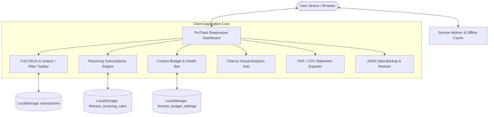

<div align="center">

# 💸 Smart Expense Tracker (PKR)
### Automated Personal Finance Manager & Progressive Web App (PWA)

[](https://smart-expense-tracker-pkr.netlify.app/)
[](https://github.com/razazaheer12/Smart-Expense-Tracker)
[](https://opensource.org/licenses/MIT)
[](https://github.com/razazaheer12/Smart-Expense-Tracker)
[](https://github.com/razazaheer12/Smart-Expense-Tracker)
[](https://github.com/razazaheer12/Smart-Expense-Tracker)

<p align="center">
  A state-of-the-art, client-side personal finance operating system localized for <strong>Pakistani Rupees (PKR)</strong>. Built with a sleek modern SaaS design, featuring <strong>Progressive Web App (PWA) offline capability</strong>, <strong>automated recurring subscription rules</strong>, <strong>dynamic budget targets & health indicators</strong>, <strong>interactive 6-month visual analytics</strong>, <strong>JSON snapshot backup & restore</strong>, and professional <strong>PDF/CSV statement exports</strong>.
</p>

[🚀 Live Demo](https://smart-expense-tracker-pkr.netlify.app/) &bull; [Key Features](#-key-features) &bull; [PWA & Automation Guide](#-how-to-use-automation--pwa-features) &bull; [Tech Stack](#️-updated-tech-stack) &bull; [Project Structure](#-project-structure) &bull; [Quick Start](#-quick-start-guide)

</div>

---

## 📖 Overview

**Smart Expense Tracker (FinTrack)** is an enterprise-grade personal finance application running entirely in your browser. Engineered around clean SaaS design principles (inspired by Stripe, Linear, and CartWise), it provides a responsive, privacy-centric financial dashboard with zero backend dependencies, zero telemetry tracking, and lightning-fast load times.

Whether managing monthly household budgets, client invoices, or recurring software subscriptions, FinTrack gives you total control over your money with military-grade client-side persistence and portable backup safety.

---

## 🏗️ System Architecture



---

## ✨ Key Features

### ⚡ 1. Progressive Web App (PWA) & Offline-First Architecture
- **Instant Installation**: Installable directly onto mobile devices (Android / iOS) and desktops (Chrome, Edge, macOS) via Web App Manifest (`manifest.json`).
- **Offline Reliability**: Service Worker (`service-worker.js`) intercepts network requests with a resilient cache-first strategy, allowing the app to function flawlessly without internet connectivity.
- **Custom Branding**: App icons with high-resolution PNGs (`192x192`, `512x512`) and scalable SVG vector assets.
- **PWA Status Bar & Theme Color**: Native mobile shell experience with theme-color integration (`#059669`).

### 🔄 2. Automated Recurring Transactions & Subscriptions Engine
- **Repeat Cycle Support**: Schedule transactions as **Weekly** (every 7 days) or **Monthly** (same calendar day each month, with automatic day clamping for shorter months).
- **Startup Due-Date Scanner**: Automatically detects rules where `nextDueDate <= today` upon launch and displays an itemized checklist prompt (`#due-recurring-modal`) to add due entries with one click.
- **Subscription Manager Modal**: Dedicated management dashboard (`#subscription-modal`) displaying:
  - Description, Category icon, and Type-colored Amount.
  - Frequency badge (`Weekly` / `Monthly`) and Status pill (`Active` / `Paused`).
  - Next Due Date display and automated countdown status.
  - Direct actions: **Post Now** (record instant occurrence), **Pause / Resume** (toggle active monitoring), and **Delete** (permanently purge rule).
- **Feed Indicators**: Recurring transactions display a discrete `🔁 Recurring` badge in the transaction activity feed.

### 🎯 3. Dynamic Budgeting & Real-Time Health Indicators
- **Custom Spending Ceilings**: Set custom budget limits for **Weekly**, **Monthly**, or **Yearly** cycles.
- **Zero Forced Defaults**: No hardcoded amounts (no auto-defaulting to 70,000). The app cleanly displays `"No Budget Set"` until explicitly configured by the user.
- **Clean Numeric Input**: Freeform integer/decimal entry without restrictive step validation or disruptive browser tooltips.
- **Real-Time Health Progress Bar**: Adapts dynamically based on periodic spend ratio:
  - 🟢 **Healthy** (`< 75%`): Mint-green progress fill.
  - 🟡 **Caution** (`75% - 89%`): Warning amber indicator with remaining budget countdown.
  - 🟠 **Critical** (`90% - 99%`): High-alert notification banner.
  - 🚨 **Overbudget** (`≥ 100%`): Danger rose red alert displaying exact overspent amount.
- **Reset / Clear Target**: Dedicated "Clear Target" control inside the modal to return to an unconstrained tracking mode.

### 📊 4. Interactive Financial Analytics (Chart.js Integration)
- **6-Month Historical Comparison Trend**: Compares chronological actual expenses against your custom budget limit across the current month and past 5 calendar months.
- **Dynamic Target Budget Line**: A yellow-dashed horizontal line dynamically reflects your converted monthly budget limit. If no budget is set, the line cleanly hides to keep the chart uncluttered.
- **Dynamic Category Donut Chart**: Breakdown of expenditures across 11 standard categories with proportional percentage distribution.
- **Cash Flow Overview**: Dual-bar comparison charting monthly income versus expenditures over time.
- **Empty State Graphics**: High-fidelity vector illustrations prompting users when insufficient data is recorded.

### 💾 5. Data Safety, Backup & Restore System (JSON Snapshots)
- **One-Click JSON Export**: Download your entire state (transactions, budget settings, and recurring subscription rules) as a timestamped `.json` file (`fintrack_backup_YYYY-MM-DD_HHMMSS.json`).
- **Flexible File Import**: Upload existing FinTrack backup files with instant schema validation and pre-restore inspection (file date span, record count, net balance).
- **Dual Restore Modes**:
  - **Merge Mode**: Deduplicates by ID, keeping current records while appending incoming ones.
  - **Replace All Mode**: Complete overwrite for quick device migrations.

### 📑 6. PDF Statements & CSV Exports
- **Download PDF Statement Report**: Formatted statements generated client-side via `jsPDF` and `jsPDF-AutoTable` featuring dark header styling, zebra striping, category breakdown summaries, and income/expense color tags.
- **Export to CSV**: Produces standardized RFC 4180 spreadsheet-ready `.csv` files compatible with Microsoft Excel, Google Sheets, and Apple Numbers.

### ✏️ 7. Full CRUD, Filtering & Responsive Navigation
- **In-Place Form Editing**: Click any transaction to edit its description, amount, date, category, or recurring status in real-time.
- **Live Search & Filter Toolbar**: Real-time query search across descriptions and categories, filter pills for *All / Income / Expense*, and sorting by *Newest, Oldest, Highest, or Lowest*.
- **Mobile Action Header**: On screens `> 768px`, displays horizontal desktop action pills. On screens `≤ 768px`, smoothly collapses into a floating **Actions** hamburger dropdown menu.

---

## 🛠️ Updated Tech Stack

| Layer | Technology | Purpose |
| :--- | :--- | :--- |
| **Structure** | **HTML5** | Accessible semantic dashboard markup, dialog overlays, responsive viewport |
| **Styling** | **CSS3 / Variables** | Responsive CSS Grid, Flexbox, design system tokens (`:root`), mobile-first media queries |
| **App Logic** | **JavaScript (ES6+)** | State management, recurrence rules engine, date math, modal dispatchers |
| **Visual Analytics** | **Chart.js v4.x** | Interactive canvas rendering for Cash Flow, Category Donut, and 6-Month Budget Trends |
| **Document Export** | **jsPDF & AutoTable** | Client-side vector PDF statement compilation and zebra-striped tabular reports |
| **PWA & Offline** | **Service Workers** | Cache-First resource caching for offline execution |
| **Web Manifest** | **W3C Web App Manifest** | Standalone app metadata, theme color, display mode, splash icons |
| **Storage Engine** | **Web Storage API** | Browser `LocalStorage` key-value persistence with zero external tracking |
| **Typography** | **Google Fonts** | [Poppins](https://fonts.google.com/specimen/Poppins) font family (300 to 800 weights) |

---

## 📂 Project Structure

```text
Smart-Expense-Tracker/
├── icons/
│   ├── icon.svg             # Scalable SVG vector logo
│   ├── icon-192.png         # 192x192 PNG icon for mobile home screens
│   └── icon-512.png         # 512x512 PNG icon for high-DPI splash displays
├── index.html               # Main dashboard layout, modals, and semantic UI templates
├── style.css                # Mobile-first SaaS stylesheet, design tokens, and media queries
├── index.js                 # Application core: CRUD, recurrence engine, Chart.js, backup/restore
├── manifest.json            # PWA manifest declaring icons, theme colors, and standalone mode
├── service-worker.js        # Offline caching strategy and asset precaching worker
└── README.md                # Comprehensive project documentation and setup guide
```

---

## 💡 How to Use Automation & PWA Features

### 📲 1. Installing FinTrack as a PWA
1. **On Mobile (Chrome / Android)**:
   - Visit the web application URL.
   - Tap the browser menu (`⋮`) &rarr; tap **"Install App"** or **"Add to Home Screen"**.
2. **On Mobile (Safari / iOS)**:
   - Tap the **Share** button (`⎋`) &rarr; scroll down and tap **"Add to Home Screen"**.
3. **On Desktop (Chrome / Edge)**:
   - Click the **Install** icon on the right side of the address bar, or open the browser menu &rarr; **"Install FinTrack"**.
4. **Offline Use**:
   - Once installed or opened once, FinTrack caches all assets and runs anytime, even with no network connection.

---

### 🔄 2. Setting Up Recurring Rules & Subscriptions
1. Open the **Add Transaction** form.
2. Enter the transaction details (e.g. `Office Rent`, `PKR 45,000`, Category: `Rent & Housing`).
3. Toggle the **"Recurring Entry"** switch to **ON**.
4. Select the **Repeat Cycle**:
   - **Monthly**: Repeats on the same calendar day every month (e.g. Salary, Utilities, Netflix).
   - **Weekly**: Repeats every 7 days (e.g. Weekly Groceries, Fuel).
5. Click **Add Transaction**. FinTrack will save the transaction today and schedule the rule.
6. Open the **Subscriptions** modal from the header to view due dates, manually post an occurrence (**Post Now**), pause auto-prompts (**Pause**), or delete rules (**Delete**).

---

### 🎯 3. Setting Custom Budget Limits
1. In the **Budget Health** widget at the top of the dashboard, click the **"No Budget Set"** / **"Configure Budget"** button.
2. Select your timeframe: **Weekly**, **Monthly**, or **Yearly**.
3. Enter your target limit in PKR (e.g. `60000`).
4. Click **Save Budget Target**.
5. The progress bar will immediately calculate your consumption ratio for the chosen period, and the 6-Month Trend Chart will display your dynamic yellow dashed budget line.
6. To clear an active budget limit, open the modal and click **Clear Target**.

---

### 💾 4. Backing Up and Restoring Data
1. Click **Backup & Restore** in the header actions (or from the mobile menu).
2. **To Export**: Click **Download Backup File**. Your transactions, custom budget, and subscription rules will be bundled into a `.json` file.
3. **To Restore**: Click **Select .JSON File**, choose your FinTrack backup file, inspect the preview summary, choose your strategy (**Merge** or **Replace All**), and click **Confirm & Apply Restore**.

---

## 🚀 Quick Start Guide

### Option 1: Live Demo (Instant)
Test FinTrack immediately in any modern web browser:  
👉 **[https://smart-expense-tracker-pkr.netlify.app/](https://smart-expense-tracker-pkr.netlify.app/)**

---

### Option 2: Run Locally via Git Clone

1. **Clone the repository:**
   ```bash
   git clone https://github.com/razazaheer12/Smart-Expense-Tracker.git
   ```

2. **Navigate into the directory:**
   ```bash
   cd Smart-Expense-Tracker
   ```

3. **Launch the application:**
   - Double-click `index.html` to open it in your browser.
   - Or serve using VS Code's **Live Server** extension (`Right-click index.html -> Open with Live Server`).
   - Or use Python's built-in HTTP server:
     ```bash
     python -m http.server 8000
     ```
     Navigate to `http://localhost:8000`.

---

### Option 3: Deploy to Netlify / Vercel / GitHub Pages

Because **FinTrack** is a 100% vanilla client-side application without build steps or npm compilation, deployment is instant:

#### Deploy on Netlify:
1. Navigate to [Netlify](https://www.netlify.com/) and select **Add new site** &rarr; **Import an existing project**.
2. Connect your GitHub account and select `razazaheer12/Smart-Expense-Tracker`.
3. Leave the build command and publish directory empty (defaults to root `/`).
4. Click **Deploy Site**.

#### Deploy on GitHub Pages:
1. Push your repository to GitHub:
   ```bash
   git add .
   git commit -m "Deploy Smart Expense Tracker"
   git push origin main
   ```
2. On GitHub, go to your repository **Settings** &rarr; **Pages**.
3. Under **Branch**, select `main` and directory `/ (root)`, then click **Save**.
4. Your site will be published at `https://<username>.github.io/Smart-Expense-Tracker/`.

---

## 📄 License

This project is open-source and licensed under the [MIT License](https://opensource.org/licenses/MIT). You are free to modify, customize, and deploy it for personal or commercial projects.

---

<div align="center">
  <sub>Designed &amp; Engineered with ❤️ by <a href="https://github.com/razazaheer12">Raza Zaheer</a></sub>
</div>
